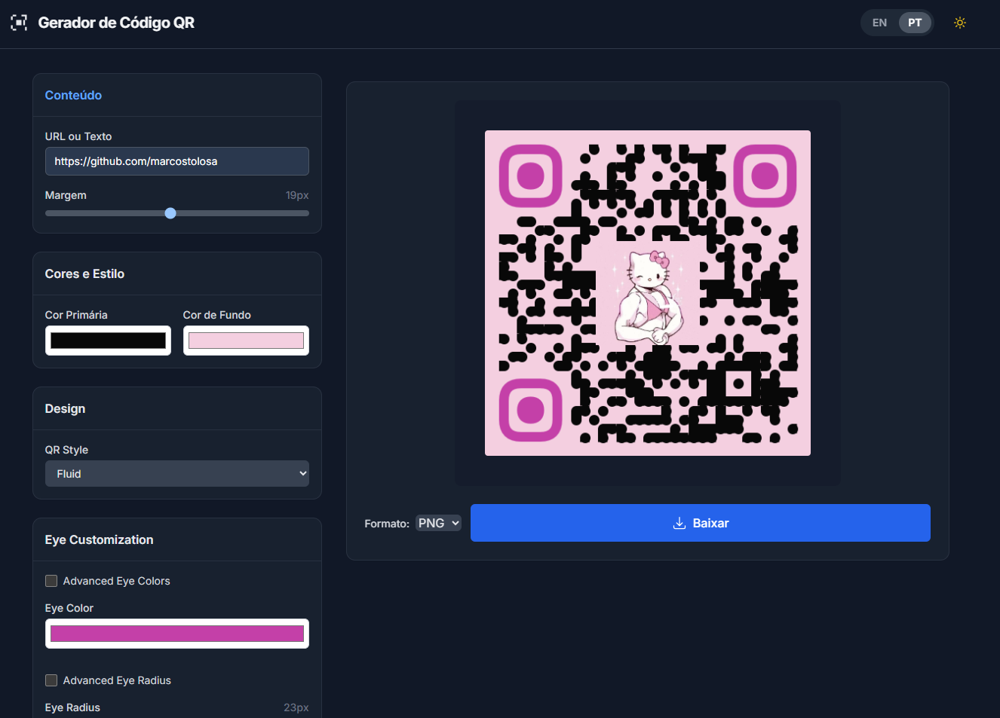

# QR Code Generator


**Live Demo**: [qrcode.mindsecurity.org](https://qrcode.mindsecurity.org)

Modern QR code generator with advanced customization capabilities. Built with React/TypeScript for security professionals and developers who need reliable QR code generation with full control over styling and output.



## Features

### Core
- Real-time QR code generation with live preview
- Multiple export formats: PNG, JPEG, SVG
- High-resolution output suitable for print and digital use
- Client-side processing - no data leaves your browser

### Customization
- Foreground/background color control
- QR pattern styles: squares, dots, fluid
- Advanced corner eye customization (basic and advanced modes)
- Logo embedding with size, opacity, and positioning controls
- Logo padding with square/circle styles and border radius
- Error correction levels: L, M, Q, H
- Configurable quiet zone margins

### Mobile Interface
- Accordion-style controls (one section open at a time)
- QR code always visible and prioritized on mobile devices
- Responsive layout optimized for all screen sizes
- Touch-friendly interface with smooth animations

### Technical
- TypeScript for type safety and development efficiency
- Tailwind CSS for consistent styling
- Vite for fast builds and hot reload during development
- GitHub Actions for automated deployment

## Quick Start

```bash
git clone https://github.com/marcostolosa/QRCode-Gen.git
cd QRCode-Gen
npm install
npm run dev
```

## Build

```bash
npm run build      # Production build
npm run preview    # Preview production build
```

Built files are output to `dist/` directory.

## Usage

1. Enter data in the input field (URL, text, or any string)
2. Adjust styling options as needed
3. Select output format
4. Download the generated QR code

### Advanced Eye Customization
- **Basic mode**: Single color and radius applied to all corner eyes
- **Advanced mode**: Separate outer/inner colors and individual radius control

### Logo Integration
- Upload PNG, JPEG, or SVG files
- Size range: 20-200 pixels
- Opacity control: 10-100%
- Padding options: square or circular
- Border radius for square padding style
- Optional background color behind logo

## Configuration

Core QR code properties:

```typescript
interface QRCodeOptions {
  value: string;
  size: number;
  fgColor: string;
  bgColor: string;
  qrStyle: 'squares' | 'dots' | 'fluid';
  ecLevel: 'L' | 'M' | 'Q' | 'H';
  quietZone: number;
  logoImage?: string;
  logoWidth: number;
  logoHeight: number;
  logoOpacity: number;
  logoPadding: number;
  logoPaddingStyle: 'square' | 'circle';
  logoPaddingRadius: number;
  eyeColor: string | { outer: string; inner: string };
  eyeRadius: number | { outer: number; inner: number };
}
```

## Deployment

Automatically deployed to GitHub Pages via GitHub Actions:
- **Production**: [qrcode.mindsecurity.org](https://qrcode.mindsecurity.org)
- **GitHub Pages**: [marcostolosa.github.io/QRCode-Gen](https://marcostolosa.github.io/QRCode-Gen/)


## Dependencies

**Runtime:**
- react 18.3.1
- react-dom 18.3.1  
- react-qrcode-logo 4.0.0

**Development:**
- typescript 5.2.2
- vite 5.3.1
- tailwindcss 3.4.4
- @vitejs/plugin-react 4.3.1

## Browser Support

Tested on modern browsers including Chrome, Firefox, Safari, and Edge. Mobile browsers supported on iOS and Android.

## Security

- All processing occurs client-side
- No data transmission to external servers
- No analytics or tracking
- HTTPS enforced in production

## License

Apache License 2.0

## Contributing

1. Fork repository
2. Create feature branch
3. Make changes
4. Test thoroughly
5. Submit pull request

Follow TypeScript best practices and maintain responsive design compatibility.